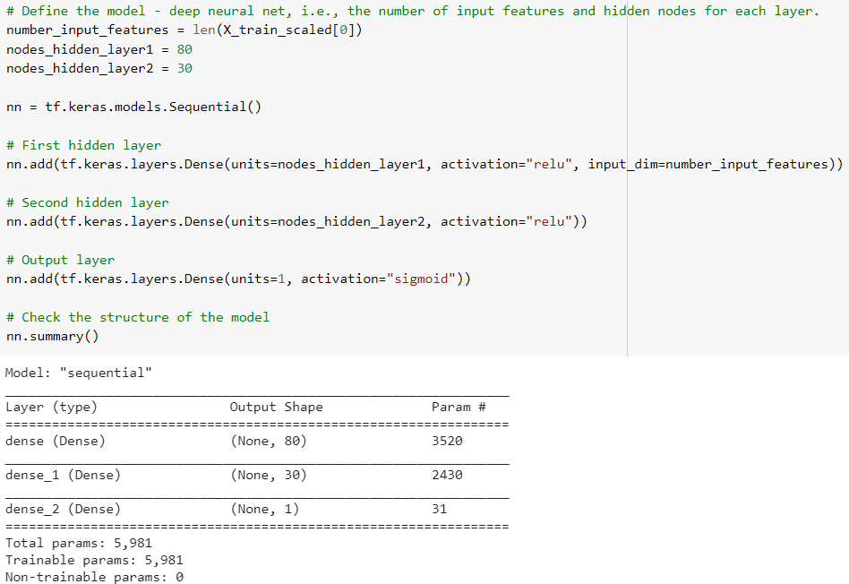
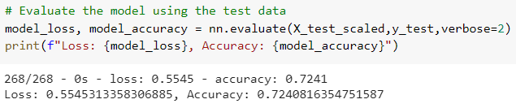
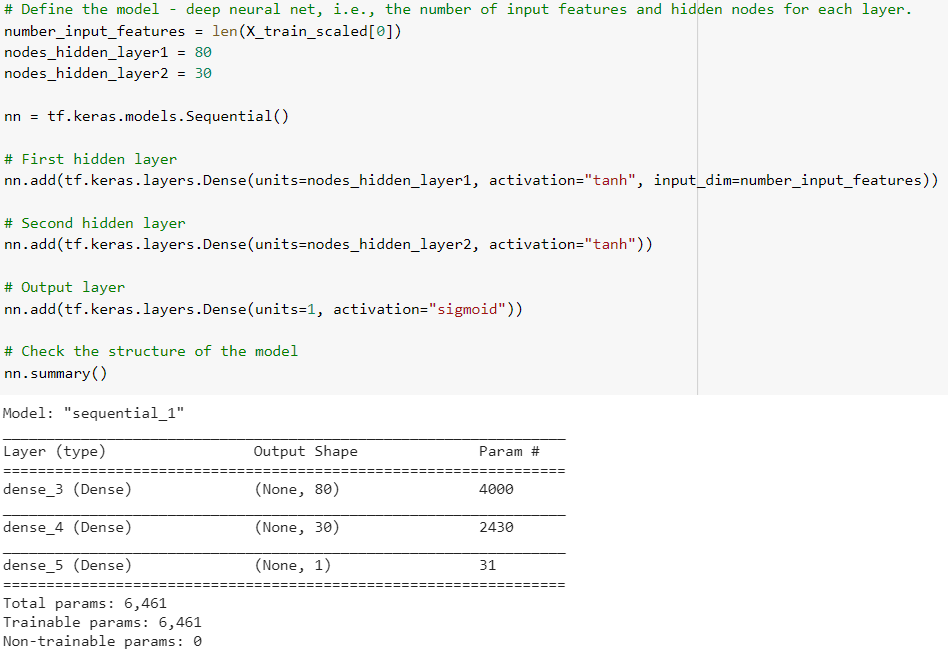
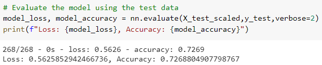
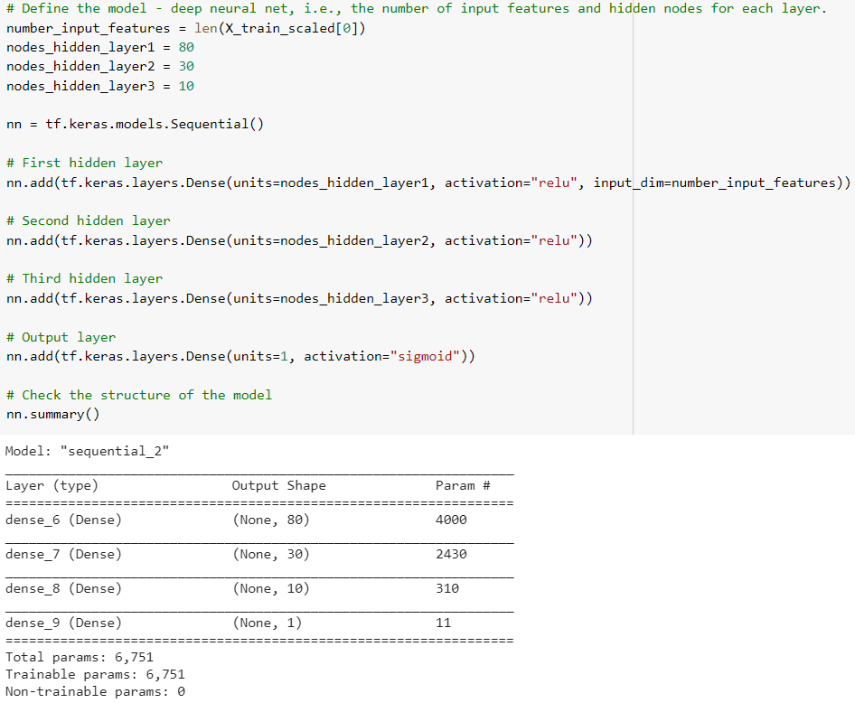
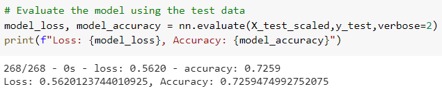

# Neural_Network_Charity_Analysis

## Overview of the analysis:

The purpose of this project is to use machine learning and neural networks in order to create a classifier to predict whether applicants will be successful if funded by a non-profit foundation.

## Results:

### Data Preprocessing
 
**- What variable(s) are considered the target(s) for your model?**

The column "IS_SUCCESSFUL" was considered the target for this model. It contains information whether the money was used effectively or not.

**- What variable(s) are considered to be the features for your model?**

The columns "APPLICATION_TYPE", "AFFILIATION", "CLASSIFICATION", "USE_CASE", "ORGANIZATION", "STATUS", "INCOME_AMT", "SPECIAL_CONSIDERATIONS", and "ASK_AMT" are considered to be the features for this model.

**- What variable(s) are neither targets nor features, and should be removed from the input data?**

"EIN" and "NAME" are identification columns and were removed from the input data.
 
 
### Compiling, Training, and Evaluating the Model
 
**- How many neurons, layers, and activation functions did you select for your neural network model, and why?**

This neural network model has two hidden layers: one has 80 neurons and the other has 30 neurons.
The activation functions are relu and sigmoid.

**- Were you able to achieve the target model performance?**

The target model performance was not achieved because the target predictive accuracy was lower than 75%.

**- What steps did you take to try and increase model performance?**

In order to try to increase model performance a different activation function was used (tanh), however, the target model performance was not achieved.

Another attempt was made by adding a third hidden layer and increasing the number of neurons, however, the target predictive accuracy was lower than 75%.

 
 
## Summary:

All three attempts of using this neural network model did not achieve the target performance of 75% accuracy. In order to solve this, a different model could be used like Random Forest, since this is a binary classification problem.